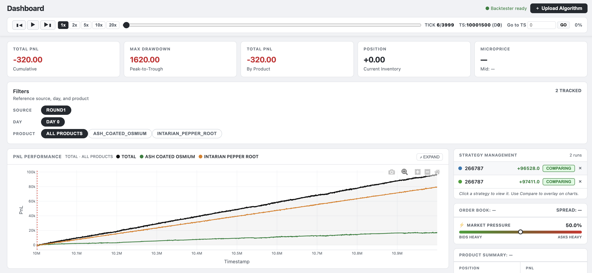
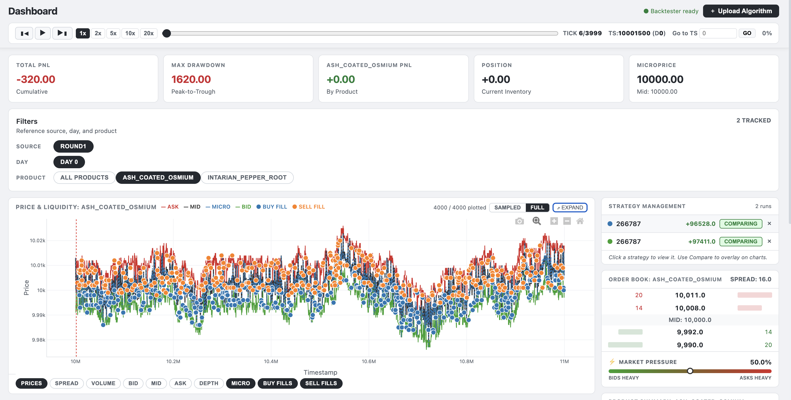
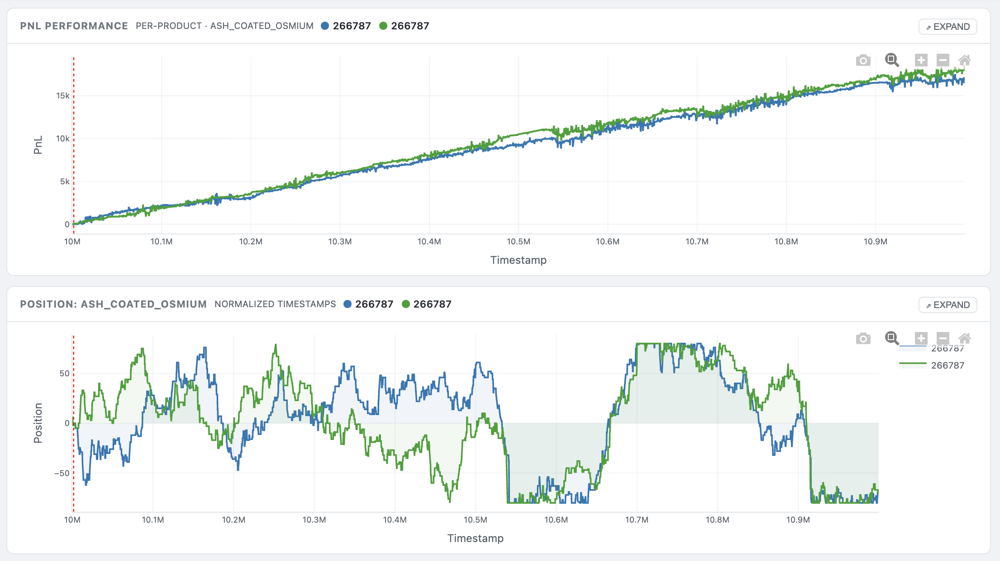
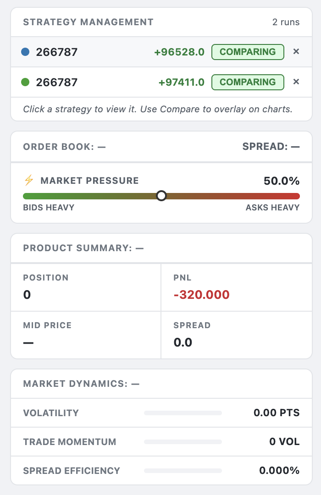
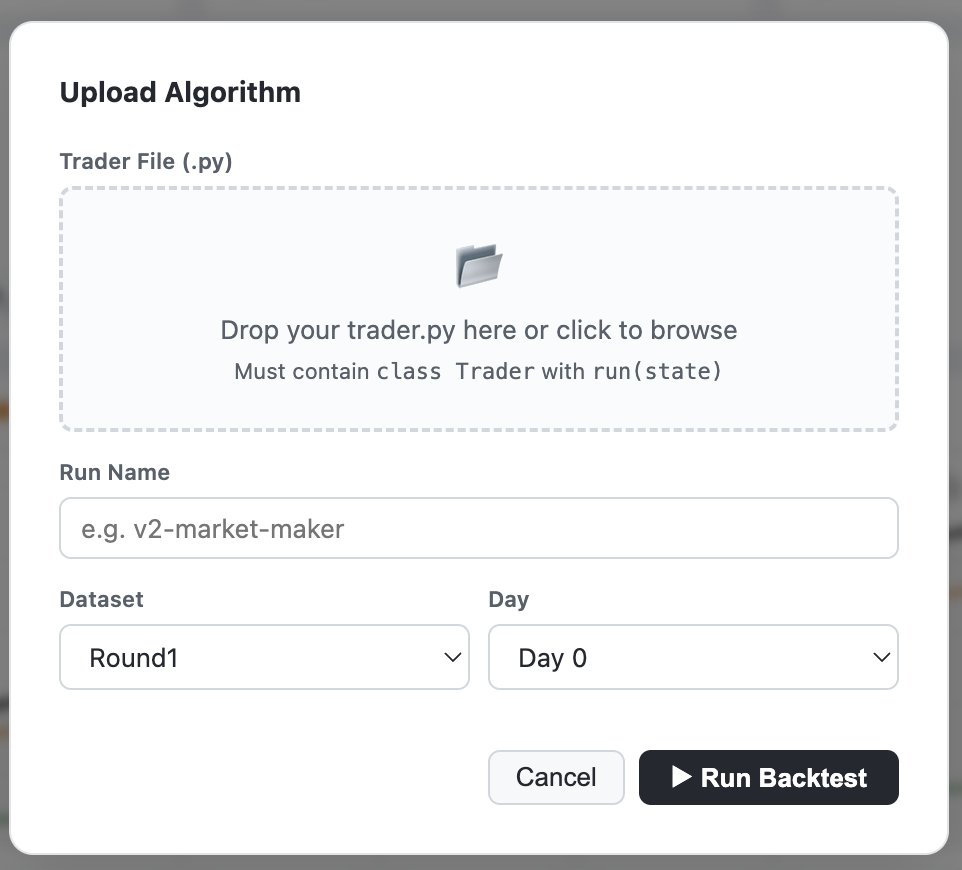

# IMC Prosperity 4 — Local Backtester Dashboard

A fully local, interactive backtesting dashboard for IMC Prosperity 4. Upload your Python trader, run it against any round dataset, and get professional-grade interactive charts — entirely on your own machine, no data sent anywhere.

---

## Preview

### Main Dashboard


### Price & Liquidity — per-product view with order book


### PnL Performance & Position — multi-run comparison


### Strategy Management, Order Book & Market Dynamics


---

## Features

- **Interactive charts** — Price & Liquidity (Ask/Bid/Mid/Microprice), PnL Performance, Position
- **Multi-run comparison** — overlay multiple algorithms on the same charts simultaneously
- **Tick-by-tick playback** — scrub through the replay with a slider at 1×–20× speed
- **Live Order Book** — updates in real time as you scrub
- **Product filters** — switch between ALL PRODUCTS and individual assets instantly
- **Buy/Sell fill markers** — see your fills on the price chart with hover details
- **Expand to full screen** — any chart can be expanded to fill the viewport
- **Trackpad scroll zoom** on all charts
- **Fully offline** — nothing leaves your machine

---

## Requirements

| Dependency | Version | Purpose |
|---|---|---|
| Python | 3.9+ | Dashboard server + trader runner |
| Rust + Cargo | stable | Build the backtester binary |
| Flask | 3.0+ | Web server (auto-installed) |

---

## Installation

### macOS

**1. Install Xcode command line tools**
```bash
xcode-select --install
```

**2. Install Rust**
```bash
curl --proto '=https' --tlsv1.2 -sSf https://sh.rustup.rs | sh
source "$HOME/.cargo/env"
```

**3. Verify Python is available**
```bash
python3 --version   # should be 3.9 or higher
```

**4. Clone the repo**
```bash
git clone https://github.com/indramandal85/imc-prosperity-4-backtester.git
cd imc-prosperity-4-backtester
```

**5. Install Python dependencies**
```bash
pip3 install -r web/requirements.txt
```

**6. Build the backtester binary**
```bash
make install
```
> If the build stalls while `syspolicyd` uses high CPU, run: `sudo killall syspolicyd` then retry.

**7. Start the dashboard**
```bash
./web/start.sh
```

Open **http://localhost:8000** in your browser.

---

### Linux (Ubuntu / Debian)

**1. Install system dependencies**
```bash
sudo apt update
sudo apt install -y python3 python3-pip curl build-essential
```

**2. Install Rust**
```bash
curl --proto '=https' --tlsv1.2 -sSf https://sh.rustup.rs | sh
source "$HOME/.cargo/env"
```

**3. Clone the repo**
```bash
git clone https://github.com/indramandal85/imc-prosperity-4-backtester.git
cd imc-prosperity-4-backtester
```

**4. Install Python dependencies**
```bash
pip3 install -r web/requirements.txt
```

**5. Build the backtester binary**
```bash
make install
```

**6. Start the dashboard**
```bash
./web/start.sh
```

Open **http://localhost:8000** in your browser.

---

### Windows (via WSL2)

Native Windows is not supported. Use WSL2 with Ubuntu.

**1. Install WSL2**

Open PowerShell as Administrator and run:
```powershell
wsl --install
```
Restart your computer. Ubuntu will be set up automatically.

**2. Open Ubuntu from the Start menu**, then follow the **Linux steps above** exactly inside the Ubuntu terminal.

> All commands from step 1 onward run inside the WSL2 Ubuntu shell, not in PowerShell or Command Prompt.

---

## Running the Dashboard

Once installed, every time you want to use it:

```bash
cd imc-prosperity-4-backtester
./web/start.sh
```

Then open **http://localhost:8000**

To use a different port:
```bash
PORT=8080 ./web/start.sh
```

---

## How to Use

### Step 1 — Upload your algorithm

Click **Upload Algorithm** in the top-right corner.



- Drop or browse to your `.py` trader file
- Your file must contain `class Trader` with a `run(state)` method
- Give it a name, choose a dataset (Round 1 / Tutorial) and a day
- Click **▶ Run Backtest**

### Step 2 — Explore the charts

**Product filter buttons** control all charts at once:
- **ALL PRODUCTS** → total PnL with per-product breakdown + combined position chart
- **ASH_COATED_OSMIUM / INTARIAN_PEPPER_ROOT** → all three charts (Price & Liquidity, PnL, Position) for that asset

**Playback controls** (sticky bar at the top):

| Control | Action |
|---|---|
| Drag the slider | Scrub tick by tick |
| ▶ / ⏸ | Play / pause replay |
| 1× – 20× | Set playback speed |
| Go to TS | Jump to a specific timestamp |
| Two-finger scroll on chart | Zoom in / out |
| Click + drag | Pan |
| EXPAND button | Full-screen the chart |

**Price chart hover:**
- Move across the chart → unified tooltip shows Ask / Mid / Microprice / Bid
- Hover near a **buy or sell dot** → panel shows fill side, quantity, and price

### Step 3 — Compare algorithms

Every run appears in the **Strategy Management** panel on the right:
- Click **COMPARE** to overlay it on PnL and Position charts
- Click a row to make it the active run (drives price chart + order book)
- Click **×** to remove a run

---

## Folder Structure

```
imc-prosperity-4-backtester/
├── web/
│   ├── server.py           # Flask backend — parses logs, serves API
│   ├── start.sh            # One-command launcher
│   ├── requirements.txt    # Python dependencies
│   └── templates/
│       └── index.html      # Dashboard frontend (Plotly.js)
├── datasets/
│   ├── tutorial/           # Tutorial round CSVs
│   ├── round1/             # Round 1 CSVs (days -2, -1, 0)
│   └── round2/ … round8/   # Placeholders for future rounds
├── runs/                   # Backtest outputs — auto-created, git-ignored
├── src/                    # Rust backtester source
├── traders/
│   └── latest_trader.py    # Bundled example trader
├── scripts/                # Cargo build helper scripts
├── Sample_image/           # Dashboard screenshots
├── Makefile
├── Cargo.toml
└── README.md
```

---

## Troubleshooting

| Problem | Fix |
|---|---|
| `rust_backtester: command not found` | Run `source "$HOME/.cargo/env"` then retry |
| `flask` import error | Run `pip3 install -r web/requirements.txt` |
| Charts blank after reload | Restart server: `Ctrl+C` then `./web/start.sh` |
| Port 8000 already in use | `PORT=8080 ./web/start.sh` |
| macOS build hangs | `sudo killall syspolicyd` then `make install` |
| macOS Gatekeeper blocks binary | `xattr -d com.apple.quarantine target/release/rust_backtester` |
| WSL2: `make` not found | `sudo apt install -y make` |

---

## License

Dual-licensed under [Apache-2.0](LICENSE-APACHE) and [MIT](LICENSE-MIT).
